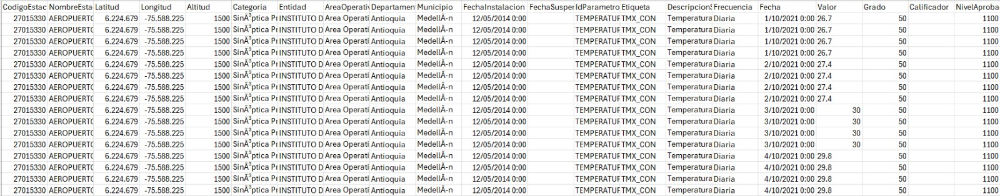
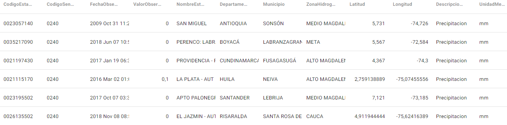

# Propuesta Bookdown Grupo 7 {#propuesta}


## Tipo de datos

En el presente proyecto se propone analizar datos meteorológicos, en particular los parámetros de precipitación y temperatura ambiente para Colombia.


## Importancia del pronóstico

La Organización Mundial de la Salud (OMS) han dejado claro que el cambio climático constituye una amenaza muy grave para la salud humana, afectando tanto a los sistemas naturales y humanos. Este fenómeno es un multiplicador de amenazas que podría revertir décadas de avances en salud. Últimamente se observan fenómenos meteorológicos y climáticos más frecuentes e intensos, como tormentas, calor extremo, sequías e incendios que aumentan el riesgo de mortalidad, enfermedades y emergencias de salud [@oms_cambio_climatico].

La Organización Meteorológica Mundial (OMM) celebró este año del Día Meteorológico Mundial llamándonos a estar "a la vanguardia de la acción por el clima" lo cual le apunta a los Objetivos de Desarrollo Sostenible, en dónde es claro para la entidad que las predicciones climáticas y meteorológicas son cruciales para mejorar la producción alimentaria, así como gestionar la enfermedades sensibles al clima y generar sistemas de alertas tempranas [@omm_dia_meteorologico].


## Fuente de datos

En Colombia, el Instituto de Hidrología, Meteorología y Estudios Ambientales (IDEAM) es la institución de apoyo técnico y científico al Sistema Nacional Ambiental, que tiene como misión producir información confiable sobre el estado de los recursos naturales y el medio ambiente [@ideam_entidad].

El IDEAM cuenta con un Banco de Datos en línea (DHIME) [@ideam_dhime] del cual se pueden descargar series de tiempo de los diferentes parámetros y variables que mide la entidad con sus estaciones hidrometeorológicas en los diferentes departamentos y municipios del país.

De la misma manera, en la Plataforma Nacional de Datos Abiertos de Colombia [@mintic_datos_abiertos] se cuentan con conjuntos de datos (tanto del IDEAM, como de otras entidades) de precipitación y de temperatura para descargar o consumir por medio de API.

A continuación se pueden apreciar pantallazos con una muestra de datos de temperatura obtenidos del IDEAM y de precipitación de Datos Abiertos:

```{r temp-datos, echo=FALSE, fig.cap='Muestra datos temperatura IDEAM', fig.align='center'}
 
```

```{r precip-datos, echo=FALSE, fig.cap='Muestra datos precipitación Datos Abiertos', fig.align='center'}
 
```


## Consideraciones finales

En la presente propuesta se han presentado fuentes confiables de datos para el proyecto y se ha descrito la importancia de las variables a analizar, especialmente en un contexto de cambio climático, por lo tanto, es claro que predecir o pronosticar series de tiempo como la precipitación y la temperatura en el país es relevante por su importancia en la salud; su impacto en otras áreas como la agricultura, la gestión de riesgos naturales (p.ej. incendios) e incluso para el turismo.
